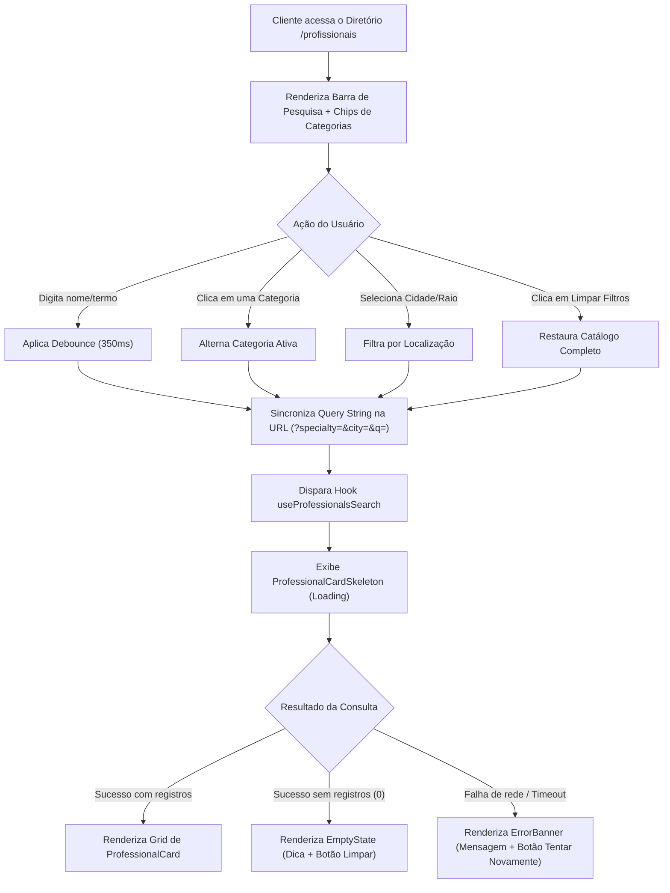
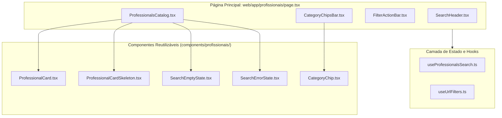
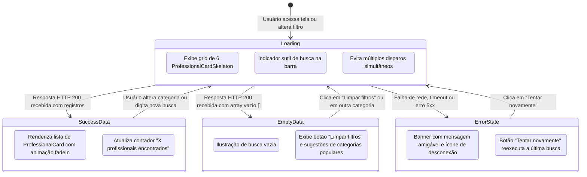
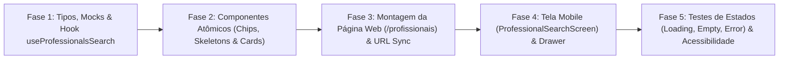

# 📋 PRD — Frontend de Busca e Diretório de Profissionais por Categoria e Localização

| Metadado | Detalhe |
| :--- | :--- |
| **Projeto** | RentalSpouse — Plataforma de Serviços Residenciais ("Marido de Aluguel") |
| **Documento** | Product Requirements Document (PRD) — Frontend de Busca e Diretório de Profissionais |
| **Arquivo** | `PRD_Frontend_Busca_Profissionais.md` |
| **Issue Relacionada** | GitHub Issue #20 (História do Cliente) & GitHub Issue #41 (Frontend Task) |
| **Versão** | `1.0.0` |
| **Status** | Aprovado para Desenvolvimento |
| **Escopo** | **EXCLUSIVAMENTE FRONTEND** (Web Next.js 14+ App Router & Mobile React Native/Expo) |
| **Arquitetura** | Component-Driven UI, Schema Validation, Reatividade por Hooks & Sincronização de Estado de URL |

---

## 1. Visão Geral e Objetivos do Produto (Frontend)

### 1.1 Contexto e História de Usuário (GitHub Issue #20)
> **História de Usuário**:
> *"#4 SENDO um cliente, EU QUERO buscar profissionais filtrando por categoria (elétrica, encanamento, montagem, etc.), PARA encontrar rapidamente a pessoa certa para o meu problema."*

A busca e seleção de profissionais qualificados é a principal funcionalidade de descoberta do RentalSpouse. O cliente chega à plataforma com uma necessidade urgente (ex: vazamento na pia, curto-circuito, montagem de um armário) ou planejada (pintura, reformas). A interface precisa entregar uma experiência ágil, transparente e intuitiva, permitindo filtrar por especialidade, localização e avaliar o perfil de cada profissional antes de iniciar contato.

### 1.2 Objetivo do Documento
Especificar todos os requisitos visuais, comportamentais, arquiteturais e de experiência de usuário (**exclusivamente no lado cliente / frontend**) para a tela de diretório e busca de profissionais, contemplando **Web (Next.js 14)** e **Mobile (React Native/Expo)**.

> ⚠️ **Restrição Arquitetural**: Este PRD não aborda nem prescreve tabelas de banco de dados, migrações ORM ou rotas internas de servidor. Ele define a interface com o usuário, componentes, gerenciamento de estado local/URL e os contratos de consumo de dados da perspectiva do cliente.

### 1.3 Personas e Casos de Uso
1. **Cliente com Urgência Residencial**:
   - Precisa selecionar a categoria desejada (ex: *Hidráulica*) com apenas 1 clique logo na entrada e ver profissionais disponíveis imediatamente na sua cidade.
2. **Cliente Comparando Prestadores**:
   - Deseja visualizar as qualificações, especialidades secundárias, biografia e raio de atuação em quilômetros antes de solicitar orçamento.
3. **Cliente em Dispositivo Móvel**:
   - Interage via toques rápidos em carrossel horizontal de categorias, acessa filtros refinados via gaveta deslizante (Drawer/Bottom Sheet) e navega sem recarregamento de página.

### 1.4 Pilares de UI/UX
- **Descoberta em 1 Clique**: Chips de categorias principais sempre visíveis e acionáveis no topo.
- **Feedback Imediato**: Transições suaves, estado de carregamento com *Skeletons* estruturados e resposta a digitação com *Debounce*.
- **Sincronização de Estado (Web)**: Filtros refletidos na URL (`?specialty=...&city=...`), viabilizando favoritos, histórico de navegação e compartilhamento de links.
- **Resiliência Estrita (`AI_RULES.md`)**: Tratamento mandatório dos 3 estados fundamentais de tela: **Loading**, **Error** (com ação de retry) e **Success/Data** (incluindo **Empty State** bem instruído).

---

## 2. Identidade Visual e Design Tokens

A interface de busca adota o Design System oficial do RentalSpouse, compatível com Dark e Light Mode nativos e classes utilitárias do Tailwind CSS.

### 2.1 Paleta de Cores e Tokens Oficiais

```css
/* Paleta Oficial do Sistema RentalSpouse */
--rs-bg:             #f4f7fe (Light) | #0b0c0f (Dark)  /* Fundo principal da página */
--rs-surface:        #ffffff (Light) | #17181d (Dark)  /* Fundo de cards de profissionais e painéis */
--rs-surface-2:      #eef3fb (Light) | #202127 (Dark)  /* Inputs de busca, chips inativos, badges secundárias */
--rs-border:         #e2e8f4 (Light) | #2c2f37 (Dark)  /* Bordas divisórias de cartões e cabeçalho */
--rs-border-strong:  #cbd8ec (Light) | #3f444f (Dark)  /* Hover de inputs e cards */
--rs-text:           #0e1b2e (Light) | #f8fafc (Dark)  /* Tipografia primária (alta legibilidade) */
--rs-text-muted:     #64748b (Light) | #a8b2c1 (Dark)  /* Rótulos secundários, cidades, biografia curta */
--rs-text-soft:      #94a3b8 (Light) | #7f8899 (Dark)  /* Placeholders e ícones neutros */
--rs-primary:        #1d4ed8 (Light) | #3b82f6 (Dark)  /* Destaque primário, chips ativos, botões de ação */
--rs-primary-hover:  #1e40af (Light) | #2563eb (Dark)  /* Hover de botões primários */
--rs-accent:         #2563eb (Light) | #60a5fa (Dark)  /* Realce de ícones e links */
--rs-error:          #dc2626 (Light) | #fb7185 (Dark)  /* Estados de erro e feedback negativo */
--rs-success:        #059669 (Light) | #34d399 (Dark)  /* Selos de verificação e status ativo */
```

### 2.2 Classes e Componentes Visuais Base
- **Card de Profissional**: `.glass-panel` ou `bg-rental-surface border border-rental-border rounded-2xl shadow-panel hover:border-rental-primary/40 transition-all`.
- **Barra de Pesquisa**: `.glass-input` com foco em `focus:ring-2 focus:ring-rental-primary/30`.
- **Chip de Categoria**:
  - *Inativo*: `bg-rental-surface2 text-rental-muted border border-rental-border hover:border-rental-primary hover:text-rental-ink`.
  - *Ativo*: `bg-rental-primary text-white border-rental-primary shadow-primary font-semibold`.

---

## 3. Especificação Funcional e Comportamental da Interface



### 3.1 Anatomia da Interface (Layout em Seções)

A página é dividida em 5 seções funcionais:

1. **Header de Busca e Contexto (`SearchHeader`)**:
   - Título claro: *"Encontre Profissionais Qualificados"*.
   - Subtítulo explicativo: *"Eletricistas, encanadores, montadores e mais profissionais verificados para o seu lar."*.
   - Input de texto livre com ícone de lupa, placeholder informativo (*"Buscar por nome, especialidade ou termo..."*) e botão de limpeza rápida (`×`).
2. **Carrossel / Barra de Categorias Rápidas (`CategoryChipsBar`)**:
   - Chips horizontais baseados no catálogo oficial do sistema (`SPECIALTIES`):
     - **Todas** (Opção neutra para ver todos os profissionais)
     - **Elétrica** (Ícone: `Zap`)
     - **Hidráulica** (Ícone: `Droplets`)
     - **Pintura** (Ícone: `Paintbrush`)
     - **Montagem de Móveis** (Ícone: `Hammer`)
     - **Marcenaria** (Ícone: `Axe` ou `SquareDashedKanban`)
     - **Limpeza** (Ícone: `Sparkles`)
     - **Jardinagem** (Ícone: `Trees` ou `Flower2`)
     - **Ar-condicionado** (Ícone: `Wind`)
     - **Reparos Gerais** (Ícone: `Wrench`)
   - Suporte a rolagem horizontal suave (*horizontal scroll*) em dispositivos móveis.
3. **Barra de Controle e Filtros Secundários (`FilterBar`)**:
   - Campo de filtro por **Cidade / UF**.
   - Contador dinâmico de resultados: *"X profissionais encontrados"*.
   - Botão para **"Limpar todos os filtros"** (exibido apenas quando houver algum filtro ativo).
   - Botão **"Filtros avançados"** (abre gaveta/drawer no mobile).
4. **Grid de Resultados (`ProfessionalsGrid`)**:
   - Disposição em grade responsiva:
     - Mobile: 1 coluna (`grid-cols-1`)
     - Tablet (>= 768px): 2 colunas (`grid-cols-2`)
     - Desktop (>= 1280px): 3 colunas (`grid-cols-3`)
5. **Paginação ou Carregamento Sob Demanda (`LoadMoreControl`)**:
   - Botão *"Carregar mais profissionais"* ou paginação numérica simplificada.

---

### 3.2 Especificação Detalhada do Card de Profissional (`ProfessionalCard`)

Cada cartão representa um prestador e deve conter as seguintes informações visuais:

| Elemento Visual | Tipo | Descrição e Regra de Exibição | Comportamento Interativo |
| :--- | :--- | :--- | :--- |
| **Avatar / Foto** | Imagem / Iniciais | Foto do profissional ou avatar estilizado com as iniciais do nome sobre fundo com a cor primária (`bg-rental-primary/10`). | Hover sutil com transição |
| **Badge de Verificado** | Ícone + Tag | Selo com ícone `ShieldCheck` em verde (`text-rental-success`) indicando perfil ativo e verificado na plataforma. | Tooltip: *"Profissional Verificado"* |
| **Nome Completo** | Tipografia H3 | Nome do profissional em destaque (`font-bold text-rental-ink text-base line-clamp-1`). | Link acessível para visualização do perfil |
| **Localização e Raio** | Texto + Ícone | Ícone de `MapPin` acompanhado de `"Cidade - UF • Atende até X km"`. Ex: *"São Paulo - SP • Raio de 25 km"*. | Indica a área de cobertura do profissional |
| **Badges de Especialidades** | Tags / Chips | Pílulas visuais listando as especialidades cadastradas. Caso o usuário tenha filtrado por uma especialidade específica, essa badge recebe destaque cromático. Exibe até 3 badges + contador `+N` se houver mais. | Clicar em uma badge filtra diretamente por ela |
| **Biografia Resumida** | Texto descritivo | Breve resumo da apresentação do profissional (`text-xs text-rental-muted line-clamp-3`). | Exibição de reticências quando ultrapassar 3 linhas |
| **Ações do Card** | Botões | Botão primário *"Solicitar Orçamento"* ou *"Entrar em Contato"* direcionando para a abertura de chamado/conversa. | Aciona fluxo de contratação / modal de contato |

---

### 3.3 Regras de Filtros e Comportamento Reativo

1. **Filtro por Categoria / Especialidade**:
   - Ao clicar no chip de uma categoria (ex: *"Elétrica"*), ela se torna a categoria ativa (`activeSpecialty`).
   - Se o usuário clicar novamente na categoria já selecionada, o filtro é desmarcado, retornando para *"Todas"*.
   - Apenas uma especialidade principal fica selecionada por vez na barra de chips rápidos para manter clareza e alta conversão.
2. **Filtro Textual com Debounce**:
   - O campo de pesquisa aceita busca por nome do profissional ou termos de serviços.
   - Aplica debounce de **350 milissegundos** antes de emitir a requisição, prevenindo chamadas excessivas a cada caractere digitado.
3. **Filtro por Cidade**:
   - Input de texto ou select das cidades atendidas.
   - Normaliza espaços e desconsidera maiúsculas/minúsculas.
4. **Sincronização com a URL (Next.js App Router)**:
   - Toda alteração nos filtros reflete instantaneamente nos parâmetros de busca da URL via `window.history.replaceState` ou `useRouter.replace`:
     - Exemplo: `/profissionais?specialty=Eletrica&city=Campinas&q=joao`
   - Ao recarregar a página ou compartilhar o link, o estado inicial dos filtros é reconstruído a partir da query string.

---

## 4. Arquitetura Modular do Frontend

### 4.1 Diagrama de Componentes (Design System)



### 4.2 Estrutura de Arquivos Proposta (`web/` e `mobile/`)

#### 4.2.1 Frontend Web (`web/`)
```text
web/
├── app/
│   └── profissionais/
│       └── page.tsx                         # Página principal do diretório e busca (App Router)
├── components/
│   └── profissionais/
│       ├── SearchHeader.tsx                 # Header com título e barra de pesquisa com debounce
│       ├── CategoryChipsBar.tsx             # Carrossel horizontal com ícones e chips de especialidades
│       ├── CategoryChip.tsx                 # Componente atômico de chip com estado ativo/inativo
│       ├── FilterActionBar.tsx              # Barra de filtros ativos, contador e botão limpar
│       ├── ProfessionalCard.tsx             # Card completo do profissional (foto, badges, raio, bio)
│       ├── ProfessionalCardSkeleton.tsx     # Skeleton animado de carregamento com shimmer effect
│       ├── SearchEmptyState.tsx             # Estado visual de zero resultados com ações de recuperação
│       └── SearchErrorState.tsx             # Banner amigável de erro com botão de retry
├── hooks/
│   ├── useProfessionalsSearch.ts            # Hook que orquestra estados (loading, data, error) e fetch
│   ├── useDebounce.ts                       # Hook utilitário para debounce de digitação
│   └── useUrlFilters.ts                     # Hook para leitura e sincronização de query params na URL
└── types/
    └── professional.ts                      # Interfaces TypeScript puras de tipagem do profissional
```

#### 4.2.2 Frontend Mobile (`mobile/`)
```text
mobile/
├── screens/
│   └── ProfessionalSearchScreen.js          # Tela de busca de profissionais no React Native/Expo
├── components/
│   └── profissionais/
│       ├── CategoryHorizontalList.js        # FlatList horizontal de categorias no mobile
│       ├── ProfessionalCardMobile.js        # Card nativo otimizado para toque com TouchableOpacity
│       ├── ProfessionalCardSkeleton.js      # Skeleton nativo para React Native
│       ├── SearchBarMobile.js               # Barra de busca nativa com botão de limpar
│       └── FilterBottomSheet.js             # Modal/BottomSheet para refinar cidade e raio
└── hooks/
    └── useProfessionalsSearch.js            # Hook compartilhado de busca adaptado para mobile
```

---

## 5. Tratamento Obrigatório dos 3 Estados de UI (`AI_RULES.md`)

Em conformidade estrita com o item 2.2 do `AI_RULES.md`, qualquer componente que consuma dados da API deve implementar com rigor os três estados:



### 5.1 Estado 1: Loading (Carregando)
- **Grid de Skeletons**: Em vez de um spinner centralizado estático, o frontend renderiza uma grade com 6 componentes `ProfessionalCardSkeleton`.
- **Efeito Visual**: Animação de pulsar (*pulse*) ou gradiente deslizante (*shimmer*) espelhando com precisão o tamanho real do avatar, nome, badges e botão do card final, garantindo **Cumulative Layout Shift (CLS) = 0**.
- **Preservação de Foco**: Os inputs de busca e os chips de categoria continuam operacionais durante o carregamento, permitindo que o usuário alterne a seleção sem travamentos.

### 5.2 Estado 2: Error (Falha de Conexão ou Servidor Indisponível)
- **Mensagem Amigável**: Não expor erros técnicos (stack traces, exceptions) na tela. Exibir mensagem empática:
  > *"Não foi possível carregar a lista de profissionais no momento. Verifique sua conexão com a internet."*
- **Ação de Recuperação (Retry)**:
  - Botão visível com ícone `RefreshCw`: *"Tentar Novamente"*.
  - Ao clicar, o hook reexecuta a requisição preservando exatamente os mesmos filtros que o cliente havia configurado.
- **Identidade do Card**: Fundo em `bg-rental-surface`, borda sutil avermelhada `border-rental-error/30` e texto explicativo.

### 5.3 Estado 3: Success & Empty State (Dados e Estado Vazio)
- **Cenário A: Registros Encontrados (Success)**:
  - Cards renderizados no grid responsivo com transição de entrada suave (`animate-fadeIn`).
  - Destaque visual na especialidade filtrada.
- **Cenário B: Zero Registros (Empty State)**:
  - Caso o backend retorne uma lista vazia (`[]`), exibe-se um painel de estado vazio acolhedor:
    - Ícone central: `SearchX` ou `Users` em tom suave (`text-rental-muted`).
    - Título: *"Nenhum profissional encontrado para os filtros selecionados"*.
    - Descrição: *"Tente buscar por outra especialidade ou remover o filtro de cidade para expandir o raio de busca."*.
    - Botão CTA: *"Limpar todos os filtros"* (restaura a visualização de todos os prestadores).

---

## 6. Especificações de Plataforma: Web vs. Mobile

### 6.1 Plataforma Web (Next.js 14+ App Router)
1. **Página Dedicada**: Rota `/profissionais` (e seção simplificada na Home `/`).
2. **Diretiva Next.js**: Componente interativo com `'use client';` para orquestração de estado reativo, hooks de filtro e debounce.
3. **Responsividade Multi-Dispositivo**:
   - *Desktop (>= 1024px)*: Barra de busca no topo, barra de chips com scroll horizontal discreto, grid em 3 colunas, cards com layout horizontal de ações.
   - *Mobile Web (< 768px)*: Barra de busca compacta, chips com rolagem por toque (overflow-x touch), cards empilhados em 1 coluna vertical com botões ocupando 100% da largura.
4. **Navegação e Acessibilidade (WAI-ARIA)**:
   - Chips de categoria com papel `role="button"` e atributo `aria-pressed="true|false"`.
   - Campo de pesquisa com `aria-label="Buscar profissionais por especialidade ou nome"`.
   - Navegação completa por teclado via `Tab` e `Enter`/`Space` para alternar categorias.
   - Suporte completo ao Dark Mode respeitando o `ThemeToggle` existente do sistema.

### 6.2 Plataforma Mobile (React Native + Expo)
1. **Componentes Nativos**:
   - `FlatList` horizontal para os chips de categoria com `showsHorizontalScrollIndicator={false}`.
   - `FlatList` vertical para a renderização dos cards com suporte a **Pull to Refresh** via `RefreshControl`.
2. **Performance em Listas Longas**:
   - Configuração de `initialNumToRender={6}`, `maxToRenderPerBatch={8}` e `windowSize={5}` na `FlatList` para evitar consumo excessivo de memória em listas volumosas.
3. **Otimização de Toque**:
   - Uso de `TouchableOpacity` ou `Pressable` com feedback háptico sutil e área de toque mínima de 44x44 dp (diretrizes Apple HIG e Google Material).

---

## 7. Contrato de Integração da API (Visão Exclusiva do Frontend)

> 💡 **Nota**: Esta seção especifica unicamente a interface de consumo que o frontend espera consumir da API existente (`/api/professionals` ou `/api/profissionais`), sem detalhar regras de banco ou lógica interna de servidor.

### 7.1 Requisição de Busca (Query Parameters)
O frontend dispara requisições HTTP GET enviando os parâmetros correspondentes aos filtros ativos:

| Parâmetro | Tipo | Exemplo | Descrição no Frontend |
| :--- | :--- | :--- | :--- |
| `specialty` | `string` (opcional) | `Eletrica` | Categoria selecionada no chip de filtro. |
| `city` | `string` (opcional) | `Sao Paulo` | Valor digitado no campo de cidade. |
| `skip` | `number` (opcional) | `0` | Deslocamento para paginação (padrão: 0). |
| `limit` | `number` (opcional) | `20` | Quantidade de profissionais por página (padrão: 20). |

- **Exemplo de URL gerada pelo frontend**:  
  `GET /api/professionals?specialty=Hidraulica&city=Campinas&skip=0&limit=20`

### 7.2 Tipagem TypeScript do Objeto Recebido (`Professional`)
```typescript
/**
 * Interface pura TypeScript para renderização do perfil do profissional no frontend.
 */
export interface Professional {
  id: number;
  name: string;
  email: string;
  phone?: string | null;
  bio: string;
  service_radius_km: number;
  specialties: string[];
  city?: string | null;
  state?: string | null;
  is_active: boolean;
  created_at?: string;
}
```

### 7.3 Tratamento de Respostas HTTP no Cliente
- **HTTP 200 OK**:
  - Se `Array.isArray(data)` e `data.length > 0`: Transiciona para o **Estado de Sucesso**, renderizando os cards.
  - Se `data.length === 0`: Transiciona para o **Empty State**, exibindo mensagens de sugestão e botão para limpar filtros.
- **HTTP 422 Unprocessable Entity**:
  - Trata como erro de parâmetro: exibe aviso inline de formato de busca inválido.
- **HTTP 500 / Network Failure (Offline / Timeout)**:
  - Transiciona para o **Estado de Erro**, apresentando o banner com botão de retry sem perder os filtros que o usuário digitou.

---

## 8. Critérios de Aceite (BDD / Gherkin)

### Cenário 1: Busca e filtro rápido por categoria (Caminho Feliz)
```gherkin
Dado que o cliente está na página de busca de profissionais
Quando clica no chip da categoria "Elétrica"
Então o chip "Elétrica" deve receber o estilo ativo (fundo azul primário e texto destacado)
E o sistema deve exibir os Skeletons de carregamento enquanto consulta os dados
E em seguida exibir apenas os profissionais que possuem a especialidade "Elétrica"
E a URL deve ser atualizada para conter "?specialty=Elétrica"
E o contador de resultados deve indicar a quantidade exata de eletricistas encontrados.
```

### Cenário 2: Remoção do filtro de categoria ao clicar novamente
```gherkin
Dado que a categoria "Pintura" está ativa no filtro
Quando o cliente clica novamente sobre o chip "Pintura"
Então o chip "Pintura" deve voltar ao estado inativo
E a categoria "Todas" deve se tornar a opção ativa
E a listagem deve recarregar exibindo profissionais de todas as categorias
E o parâmetro "specialty" deve ser removido da URL.
```

### Cenário 3: Combinação de filtros de Categoria e Cidade
```gherkin
Dado que o cliente selecionou a categoria "Hidráulica"
E digita no filtro de cidade "Santos"
Quando a busca assíncrona for concluída
Então devem ser exibidos apenas os profissionais de hidráulica cuja cidade contenha "Santos"
E os cartões devem destacar a badge "Hidráulica" e o texto "Santos - SP".
```

### Cenário 4: Busca sem resultados correspondentes (Empty State)
```gherkin
Dado que o cliente selecionou a categoria "Marcenaria" na cidade "CidadeInexistente"
Quando o serviço retornar uma lista vazia
Então a tela não deve exibir cartões em branco nem travar
E deve exibir a mensagem amigável: "Nenhum profissional encontrado para os filtros selecionados"
E deve apresentar o botão de ação "Limpar todos os filtros"
Quando o cliente clica em "Limpar todos os filtros"
Então todos os campos são resetados e o catálogo completo de profissionais volta a ser renderizado.
```

### Cenário 5: Tratamento de indisponibilidade de rede com Retry
```gherkin
Dado que o cliente tenta buscar profissionais em uma categoria
E o cliente está sem conexão de internet ou o servidor está inacessível
Quando a requisição falha
Então a tela deve exibir o componente de erro com a mensagem: "Não foi possível carregar os profissionais. Verifique sua conexão."
E deve exibir um botão "Tentar novamente"
Quando a conexão é reestabelecida e o cliente clica em "Tentar novamente"
Então o sistema executa novamente a busca mantendo os mesmos filtros previamente selecionados.
```

### Cenário 6: Acessibilidade e navegação por teclado (Web)
```gherkin
Dado que o cliente navega na tela de busca utilizando apenas o teclado
Quando pressiona a tecla Tab sucessivamente
Então o foco deve navegar de forma lógica: Barra de Pesquisa -> Chips de Categoria -> Filtro de Cidade -> Cards de Profissionais
E cada chip focado deve exibir contorno visual evidente (focus-ring)
E ao pressionar a tecla Enter sobre um chip, a categoria correspondente deve ser selecionada.
```

---

## 9. Requisitos Não Funcionais de Frontend e Qualidade

1. **Performance e Debounce**:
   - A digitação na barra de busca deve utilizar debounce estrito de 350ms, evitando chamadas repetitivas e desperdício de banda.
2. **Cumulative Layout Shift (CLS) = 0**:
   - Os cards de esqueleto (`ProfessionalCardSkeleton`) devem ter dimensões de altura e largura idênticas aos cartões finais preenchidos, evitando "pulos" de tela na transição do carregamento para os dados reais.
3. **Imutabilidade e Tipagem Estrita (TypeScript)**:
   - Proibido o uso de `any`. Todos os componentes devem declarar interfaces TypeScript para suas Props (`ProfessionalCardProps`, `CategoryChipsBarProps`, etc.).
4. **Isolamento de Estado (`Clean Code`)**:
   - A lógica de consulta assíncrona e gestão dos 3 estados deve residir em hooks dedicados (`useProfessionalsSearch`), mantendo os componentes visuais focados exclusivamente em renderização e acessibilidade.
5. **Responsividade Fluida**:
   - O layout deve ser testado e funcional em larguras de tela de 320px (smartphones compactos) até 2560px (monitores ultrawide).

---

## 10. Roadmap de Implementação Frontend



| Fase | Entregas da Squad de Frontend | Critério de Aceite / Conclusão |
| :--- | :--- | :--- |
| **Fase 1: Tipagem e Hooks** | Criação de `types/professional.ts`, hook `useDebounce.ts` e hook `useProfessionalsSearch.ts` com tratamento dos estados `loading`, `error`, `data`. | Testes unitários do hook cobrindo chamadas, debounce e transição entre os 3 estados. |
| **Fase 2: Componentes Atômicos** | Construção de `CategoryChip`, `CategoryChipsBar`, `ProfessionalCard` e `ProfessionalCardSkeleton` com design tokens oficiais. | Componentes renderizados de forma limpa no Storybook / catálogo visual sem quebras de estilo. |
| **Fase 3: Página Web e URL Sync** | Implementação de `web/app/profissionais/page.tsx` com sincronização de query params na URL e link no cabeçalho global. | Filtros refletindo na URL e mantendo histórico de navegação (voltar/avançar no navegador). |
| **Fase 4: Interface Mobile** | Implementação de `ProfessionalSearchScreen.js` no Expo com `FlatList` horizontal de chips e suporte a `RefreshControl`. | Navegação e rolagem fluida a 60 FPS no emulador Android e iOS. |
| **Fase 5: Homologação e Estados** | Validação exaustiva dos 3 estados (Loading com skeletons, Empty State com botão de reset, Error com retry) e testes de acessibilidade (WCAG AA). | 100% dos cenários de teste Gherkin validados e conformidade total com `AI_RULES.md`. |

---

> 📌 **Documento gerado em conformidade estrita com a Issue #20 e as diretrizes do RentalSpouse (`AI_RULES.md`).**  
> Foco exclusivo em camadas de apresentação, experiência de usuário (UI/UX) e consumo de cliente frontend.
