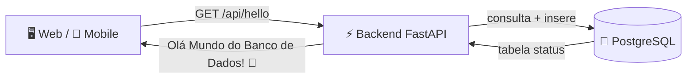

<div align="center">

# 🛠️ RentalSpouse

**Marido de Aluguel — Plataforma de Serviços de Manutenção Residencial**

Conectando clientes e prestadores de serviços de forma **ágil**, **segura** e **moderna**.

<br/>


<br/>

**Status:** 🟢 Ambiente "Olá Mundo" integrado de ponta a ponta

</div>

---

## 📚 Índice

- [Sobre o Projeto](#-sobre-o-projeto)
- [Arquitetura](#-arquitetura)
- [Stack Tecnológica](#-stack-tecnológica)
- [Fluxo "Olá Mundo!"](#-fluxo-olá-mundo)
- [Como Executar](#-como-executar)
  - [Docker (Recomendado)](#-método-1-docker-recomendado)
  - [Manual / Desenvolvedor](#-método-2-manual--desenvolvedor)
- [Testes Automatizados](#-testes-automatizados)
- [API](#-api)
- [Governança e Contribuição](#-governança-e-contribuição)

---

## 💡 Sobre o Projeto

O **RentalSpouse** é um **monorepo** de uma plataforma de serviços de manutenção residencial — o famoso *"Marido de Aluguel"* — que conecta **clientes** que precisam de pequenos reparos e melhorias em casa a **prestadores de serviços** qualificados.

O repositório atual traz a base funcional da arquitetura, validando a integração completa entre **banco de dados**, **API**, **frontend web** e **aplicativo mobile** com um fluxo "Olá Mundo" de demonstração.

---

## 🏗️ Arquitetura

O projeto é estruturado como um **monorepo desacoplado em camadas**:

```text
RentalSpouse/
├── backend/                # API REST — Python (FastAPI + SQLAlchemy 2.x + PostgreSQL)
│   ├── routes/             # Routers modulares (ex.: hello.py)
│   ├── tests/              # Testes automatizados (Pytest + SQLite em memória)
│   ├── database.py         # Conexão com o banco e sessões (SQLAlchemy)
│   ├── models.py           # Entidades ORM (ex.: tabela status)
│   ├── schemas.py          # Schemas de validação e DTOs (Pydantic v2)
│   ├── main.py             # Ponto de entrada da API, lifespan e CORS
│   └── Dockerfile          # Imagem Docker (Python 3.12-slim)
├── web/                    # Frontend Web — Next.js 14+ (App Router + Tailwind)
│   ├── app/                # Rotas e páginas (page.tsx, layout.tsx, globals.css)
│   └── Dockerfile          # Imagem Docker (Node 18)
├── mobile/                 # App Mobile — React Native (Expo)
│   ├── App.js              # Tela inicial com resolução dinâmica de IP
│   ├── app.json
│   └── babel.config.js
├── docs/                   # Documentação técnica
│   └── ARCHITECTURE.md     # Visão detalhada da arquitetura e fluxo de dados
├── .github/                # CI/CD e templates
│   ├── workflows/ci.yml
│   └── PULL_REQUEST_TEMPLATE.md
├── AI_RULES.md             # Regras de governança e desenvolvimento assistido por IA
├── docker-compose.yml      # Orquestração: PostgreSQL 15 + Backend + Web
└── .env.example            # Modelo de variáveis de ambiente
```

---

## 🧰 Stack Tecnológica

| Camada        | Tecnologia                                        | Pasta     |
|---------------|---------------------------------------------------|-----------|
| **Backend**   | Python 3.12 · FastAPI · SQLAlchemy 2.x · Pydantic v2 · psycopg2 · Uvicorn | `backend/` |
| **Web**       | Next.js 14 (App Router) · React 18 · TypeScript · Tailwind CSS | `web/`     |
| **Mobile**    | React Native · Expo 51                           | `mobile/`  |
| **Banco**     | PostgreSQL 15                                    | —         |
| **Infra**     | Docker · Docker Compose                          | —         |

> 🚫 Qualquer biblioteca nova fora desse escopo deve ser aprovada — consulte [`AI_RULES.md`](./AI_RULES.md).

---

## 🔄 Fluxo "Olá Mundo!"

A aplicação demonstra a arquitetura funcionando de ponta a ponta:



1. 🐘 **Banco de Dados (PostgreSQL)** — contém a tabela `status` (`id`, `message`).
2. ⚡ **Backend (FastAPI)** — o endpoint `GET /api/hello` acessa o banco; se a tabela estiver vazia, insere a mensagem *"Olá Mundo do Banco de Dados!"* e a retorna.
3. 🖥️ **Frontend Web & Mobile** — consomem a API REST e exibem a mensagem na interface, com tratamento de **carregamento**, **erro** e **sucesso**.

---

## 🚀 Como Executar

### 📋 Pré-requisitos

- **Docker & Docker Desktop** — método recomendado
- **Node.js** (v18+) — para rodar *web* e *mobile* fora do Docker
- **Python** (3.11 ou 3.12) — para rodar o *backend* manualmente

---

### 🐳 Método 1: Docker (Recomendado)

Suba o ambiente completo (banco + backend + web) com **3 comandos**:

**1. Clone o repositório**

```bash
git clone https://github.com/LucaS4nt0s/RentalSpouse.git
cd RentalSpouse
```

**2. Crie o arquivo de ambiente**

```bash
# Windows (PowerShell/CMD)
copy .env.example .env

# Linux / macOS / Git Bash
cp .env.example .env
```

> ✏️ Edite o `.env` com usuário/senha fortes para o PostgreSQL, se desejar.

**3. Suba os containers**

```bash
docker compose up --build
```

**🎉 Pronto! Acessos disponíveis:**

| Recurso                  | Endereço                                |
|--------------------------|-----------------------------------------|
| 🌐 **Backend API**       | http://localhost:8000/api/hello        |
| 📄 **Swagger UI**        | http://localhost:8000/docs             |
| 🖥️ **Frontend Web**      | http://localhost:3000                  |
| 🐘 **PostgreSQL**        | `localhost:5432`                       |

> 💡 Para rodar em segundo plano, use `docker compose up -d --build`. Para parar: `docker compose down`.

---

### 💻 Método 2: Manual / Desenvolvedor

#### 1. Backend (FastAPI + Pytest)

```bash
cd backend

# Criar e ativar o ambiente virtual (opcional)
python -m venv venv
# Windows:
.\venv\Scripts\activate
# Linux/Mac:
source venv/bin/activate

# Instalar dependências
pip install -r requirements.txt

# Executar os testes unitários (isolados com SQLite em memória)
pytest tests/ -v

# Subir o servidor de desenvolvimento
uvicorn main:app --reload
```

> ⚠️ O backend precisa de um PostgreSQL acessível. Defina `DATABASE_URL` (veja `.env.example`) ou use o `docker compose up db` para subir apenas o banco.

#### 2. Frontend Web (Next.js)

```bash
cd web

npm install
npm run dev
```

Acesse no navegador: **[http://localhost:3000](http://localhost:3000)**

#### 3. Frontend Mobile (Expo)

```bash
cd mobile

npm install
npx expo start
```

Pressione `a` para abrir no **Emulador Android** ou `i` no **Simulator iOS**. Em dispositivo físico, o app resolve o IP da API automaticamente.

---

## 🧪 Testes Automatizados

Os testes do backend rodam **isolados**, usando um banco em memória (`sqlite:///:memory:`), **sem depender** de um PostgreSQL ativo ou de containers Docker.

```bash
cd backend
pytest tests/ -v
```

---

## 🔌 API

### `GET /api/hello`

Retorna a mensagem armazenada no banco (inserindo-a automaticamente caso a tabela esteja vazia).

**Resposta — `200 OK`**

```json
{
  "id": 1,
  "message": "Olá Mundo do Banco de Dados!"
}
```

> 📄 A documentação interativa completa (Swagger UI) fica em `http://localhost:8000/docs`.

---

## 📜 Governança e Contribuição

Toda contribuição deve seguir as regras do [`AI_RULES.md`](./AI_RULES.md):

- ✍️ **Conventional Commits** — `feat(...)`, `fix(...)`, `test(...)`, `docs(...)`, etc.
- 🌿 **Branches** — desenvolvimento na branch `dev`; *features/bugfixes* em `feature/<nome>` / `fix/<nome>`.
- 🔀 **Integração** — via **Pull Requests** direcionados para `dev` (nunca commit direto em `main`).
- 🧪 **Testes obrigatórios** — todo novo endpoint deve vir acompanhado de testes unitários.
- 🔐 **Sem segredos** — senhas e chaves apenas via variáveis de ambiente (nunca versionadas).

---

<div align="center">

Feito com 💙 — **RentalSpouse · Marido de Aluguel**

</div>
