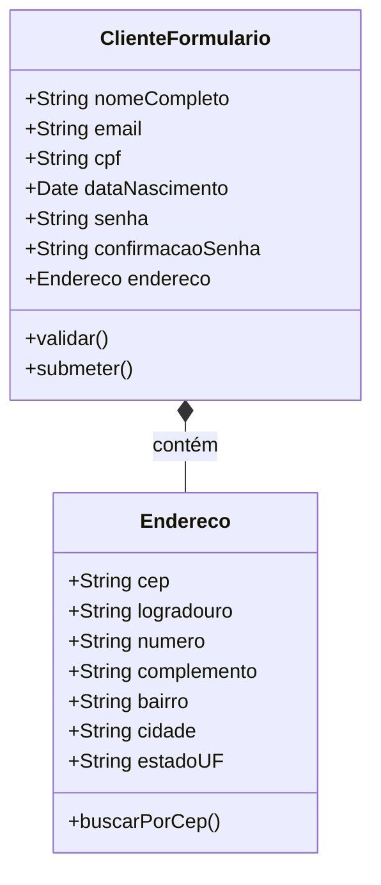
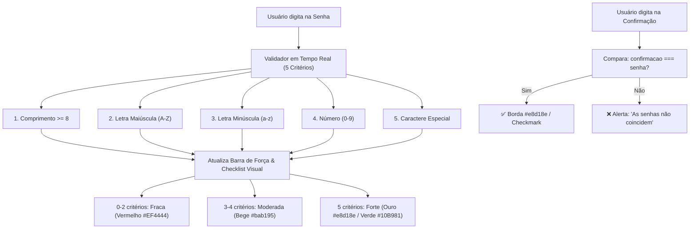
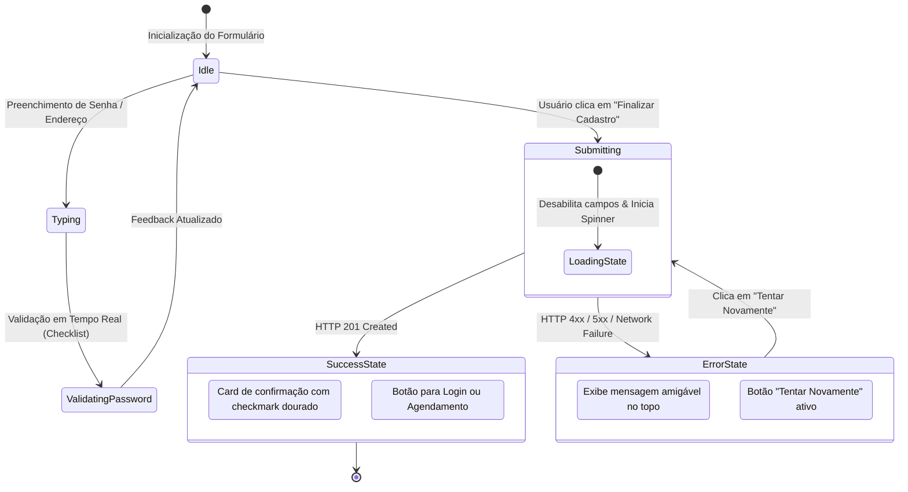
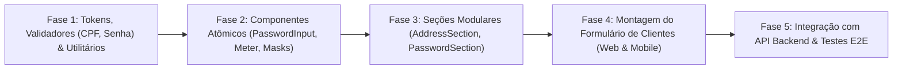

# 📋 PRD — Frontend da Página de Cadastro de Clientes (Web & Mobile)

| Metadado | Detalhe |
| :--- | :--- |
| **Projeto** | RentalSpouse — Plataforma de Serviços Residenciais ("Marido de Aluguel") |
| **Documento** | Product Requirements Document (PRD) — Frontend de Cadastro de Clientes |
| **Arquivo** | `PRD_Frontend_Clientes_Form.md` |
| **Versão** | `1.1.0` |
| **Status** | Aprovado para Desenvolvimento |
| **Plataformas** | Web (Next.js 14+ App Router) & Mobile (React Native + Expo) |
| **Arquitetura** | Frontend Modular Baseado em Componentes & Validação Orientada a Esquema |

---

## 1. Visão Geral e Objetivos do Produto

### 1.1 Contexto
O **RentalSpouse** conecta proprietários e locatários a prestadores de serviços de reparo, manutenção e reformas residenciais. O fluxo de **Cadastro de Clientes** é a porta de entrada para novos usuários na plataforma, sendo um ponto crítico de conversão, credenciamento seguro e de estabelecimento de confiança.

### 1.2 Objetivo do Documento
Especificar os requisitos funcionais, não funcionais, arquiteturais e de interface de usuário (UI/UX) para o desenvolvimento do frontend do formulário de cadastro de clientes, contemplando simultaneamente as plataformas **Web** e **Mobile**.

### 1.3 Pilares Estratégicos
1. **Experiência Unificada e Fluida**: Paridade funcional e identidade visual consistente entre Web (Next.js) e Mobile (Expo/React Native).
2. **Segurança no Acesso**: Mecanismo de autenticação robusto desde o cadastro com validação reativa em tempo real de senha forte e confirmação de senha.
3. **Modularidade e Reusabilidade (Zero Retrabalho)**: Arquitetura em camadas e componentes de formulário atômicos reutilizáveis, desenhada para viabilizar a criação ágil de formulários futuros (cadastro de prestadores, abertura de chamados, orçamentos, vistorias e recuperação de senhas).
4. **Resiliência e Tratamento Estrito de Estados**: Aderência obrigatória aos três estados fundamentais de UI (**Loading**, **Error**, **Success/Data**), conforme diretrizes do projeto (`AI_RULES.md`).

---

## 2. Paleta de Cores e Identidade Visual

A identidade visual do formulário baseia-se na paleta oficial de 5 cores corporativas do RentalSpouse, concebida para transmitir sobriedade, sofisticação e confiabilidade:

```css
/* Paleta Oficial RentalSpouse */
.color1 { #11091a }; /* Deep Obsidian / Fundo Principal */
.color2 { #2f2f4d }; /* Midnight Slate / Superfícies e Cards */
.color3 { #626970 }; /* Neutral Muted / Bordas, Linhas e Textos de Apoio */
.color4 { #bab195 }; /* Warm Sand / Destaques Secundários e Badges */
.color5 { #e8d18e }; /* Soft Gold / Destaque Primário, Ações e Foco */
```

### 2.1 Mapeamento Semântico e Sistema de Design Tokens

| Token de Design | Hexadecimal | RGB | Nome Semântico | Função no Sistema de Design |
| :--- | :--- | :--- | :--- | :--- |
| `color-primary-bg` | `#11091a` | `rgb(17, 9, 26)` | **Deep Obsidian** | Fundo primário da tela (Dark Mode), texto de altíssimo contraste no Light Mode. |
| `color-surface` | `#2f2f4d` | `rgb(47, 47, 77)` | **Midnight Slate** | Fundo de cartões, painéis, cabeçalhos de formulário, inputs em estado de repouso. |
| `color-muted-border` | `#626970` | `rgb(98, 105, 112)` | **Neutral Muted** | Bordas sutis de inputs, divisores horizontais, placeholders inativos e rótulos de apoio. |
| `color-accent-subtle`| `#bab195` | `rgb(186, 177, 149)` | **Warm Sand** | Textos secundários destacados, badges de seção, ícones inativos, hover secundário e nível moderado do medidor de senha. |
| `color-action-gold` | `#e8d18e` | `rgb(232, 209, 142)` | **Soft Gold** | Botão primário (CTA de envio), anel de foco em inputs (`focus:ring`), ícones ativos, callouts e nível forte no medidor de senha. |

### 2.2 Cores de Suporte e Feedback (Acessibilidade)
Para garantir feedback visual inequívoco sem violar a identidade visual:
- **Erro / Alerta / Senha Fraca**: `#EF4444` (Crimson Red para textos de erro, bordas inválidas e nível fraco do medidor de senha).
- **Sucesso / Requisito Atendido**: `#10B981` (Emerald Green para checkmarks de critérios de senha atendidos e validações inline bem-sucedidas).
- **Contraste de Acessibilidade (WCAG 2.1 AA)**: O botão primário (`#e8d18e`) deve sempre utilizar tipografia escura (`#11091a`) em seu interior, assegurando contraste superior a `7:1`.

### 2.3 Integração com Tailwind CSS (`web/tailwind.config.js`)
```javascript
/** @type {import('tailwindcss').Config} */
module.exports = {
  content: [
    './app/**/*.{js,ts,jsx,tsx,mdx}',
    './pages/**/*.{js,ts,jsx,tsx,mdx}',
    './components/**/*.{js,ts,jsx,tsx,mdx}',
  ],
  theme: {
    extend: {
      colors: {
        rental: {
          bg: '#11091a',
          surface: '#2f2f4d',
          muted: '#626970',
          sand: '#bab195',
          gold: '#e8d18e',
        },
      },
    },
  },
  plugins: [],
};
```

### 2.4 Tokens para Mobile (`mobile/theme/colors.js`)
```javascript
export const Colors = {
  bg: '#11091a',
  surface: '#2f2f4d',
  muted: '#626970',
  sand: '#bab195',
  gold: '#e8d18e',
  error: '#EF4444',
  success: '#10B981',
  textLight: '#F3F4F6',
  textDark: '#11091a',
};
```

---

## 3. Especificação Funcional dos Campos do Formulário

O formulário deve coletar os dados de identificação, credenciais de acesso autenticado e endereço do cliente.



### 3.1 Tabela Detalhada de Campos e Regras de Validação

| Campo | Tipo | Obrigatoriedade | Máscara / Formato | Regras de Validação | Atributos Web | Configuração Mobile |
| :--- | :--- | :--- | :--- | :--- | :--- | :--- |
| **Nome Completo** | Texto | Sim | Nenhuma | Mínimo 3 caracteres; Máximo 120 caracteres; Apenas letras e acentos (`^[a-zA-ZÀ-ÿ\s]+$`). Não permite apenas primeiro nome. | `autocomplete="name"` `type="text"` | `autoCapitalize="words"` `textContentType="name"` |
| **E-mail** | Email | Sim | Nenhuma | Formato RFC 5322 válido (`user@domain.ext`). Normalizado em minúsculas (lowercase). | `autocomplete="email"` `type="email"` | `keyboardType="email-address"` `autoCapitalize="none"` |
| **CPF** | Texto / Numérico | Sim | `000.000.000-00` | 11 dígitos numéricos; Cálculo dos 2 dígitos verificadores (DV1 e DV2); Rejeição de sequências repetidas (`111.111.111-11`, etc.). | `inputMode="numeric"` `maxLength={14}` | `keyboardType="numeric"` `maxLength={14}` |
| **Data de Nascimento** | Data | Sim | `DD/MM/AAAA` | Data no passado; Idade mínima de 18 anos completos na data atual; Idade máxima de 120 anos; Dia/mês válidos no calendário. | Web: `input type="text"` mascarado ou DatePicker nativo | Mobile: Modal DatePicker nativo (`DateTimePicker`) |
| **Senha** | Senha | Sim | Oculto (`••••••••`) com botão de alternância de visibilidade (Show/Hide) | **Validação em tempo real de Senha Forte**: Mínimo de 8 caracteres; Pelo menos 1 letra maiúscula; Pelo menos 1 letra minúscula; Pelo menos 1 número; Pelo menos 1 caractere especial. | `type="password"` `autocomplete="new-password"` | `secureTextEntry={!showPassword}` `textContentType="newPassword"` |
| **Confirmação de Senha** | Senha | Sim | Oculto (`••••••••`) com alternância de visibilidade | Deve ser idêntica ao campo **Senha**. Validação em tempo real conforme digitação e no blur. Mensagem: *"As senhas não coincidem"*. | `type="password"` `autocomplete="new-password"` | `secureTextEntry={!showConfirmPassword}` `textContentType="newPassword"` |
| **Endereço: CEP** | Numérico | Sim | `00000-000` | Exatamente 8 dígitos numéricos. Ao preencher os 8 dígitos, dispara busca automática do endereço. | `inputMode="numeric"` `maxLength={9}` | `keyboardType="numeric"` `maxLength={9}` |
| **Endereço: Logradouro** | Texto | Sim | Nenhuma | Mínimo 3 caracteres; Pré-preenchido via busca de CEP, mas editável pelo usuário. | `autocomplete="street-address"` | `autoCapitalize="words"` |
| **Endereço: Número** | Alfanumérico | Sim | Nenhuma | Mínimo 1 caractere; Máximo 10 caracteres (ex: "123", "45-B", "S/N"). | `type="text"` | `keyboardType="default"` |
| **Endereço: Complemento**| Texto | Não (Opcional) | Nenhuma | Máximo 60 caracteres (ex: "Apto 102", "Bloco B", "Fundos"). | `type="text"` | `autoCapitalize="sentences"` |
| **Endereço: Bairro** | Texto | Sim | Nenhuma | Mínimo 2 caracteres; Pré-preenchido via CEP. | `type="text"` | `autoCapitalize="words"` |
| **Endereço: Cidade** | Texto | Sim | Nenhuma | Mínimo 2 caracteres; Pré-preenchido via CEP. | `type="text"` | `autoCapitalize="words"` |
| **Endereço: Estado (UF)** | Seleção (UF) | Sim | 2 letras maiúsculas | Sigla de uma das 27 Unidades Federativas do Brasil (ex: SP, RJ, MG, etc.). | `<select>` estilizado | `<Picker>` ou ActionSheet nativo |

---

### 3.2 Regras de Senha Forte e Confirmação em Tempo Real

A criação de senha exige feedback reativo instantâneo enquanto o usuário digita, eliminando a incerteza antes da submissão do formulário.

#### 3.2.1 Os 5 Critérios Obrigatórios de Senha Forte
Para ser considerada válida e permitir o envio do formulário, a senha deve cumprir simultaneamente todos os 5 critérios:

| Critério | Regra / Expressão Regular | Descrição Visual |
| :--- | :--- | :--- |
| **1. Comprimento Mínimo** | `senha.length >= 8` | No mínimo 8 caracteres no total. |
| **2. Letra Maiúscula** | `/[A-Z]/.test(senha)` | Pelo menos 1 letra maiúscula (A-Z). |
| **3. Letra Minúscula** | `/[a-z]/.test(senha)` | Pelo menos 1 letra minúscula (a-z). |
| **4. Número** | `/[0-9]/.test(senha)` | Pelo menos 1 caractere numérico (0-9). |
| **5. Caractere Especial** | `/[!@#$%^&*()_+\-=\[\]{};':"\\|,.<>\/?]/.test(senha)` | Pelo menos 1 símbolo especial (`!`, `@`, `#`, `$`, `%`, etc.). |



#### 3.2.2 Medidor Visual de Força da Senha (Password Strength Meter)
O componente deve renderizar uma barra segmentada em 3 níveis logo abaixo do campo de senha:
1. **Fraca (1 a 2 critérios)**: 1/3 da barra preenchida na cor `#EF4444` (Vermelho) com o texto *"Senha fraca"*.
2. **Moderada (3 a 4 critérios)**: 2/3 da barra preenchida na cor `.color4 (#bab195)` (Warm Sand) com o texto *"Senha moderada"*.
3. **Forte (5 critérios satisfeitos)**: Barra completa (3/3) preenchida na cor `.color5 (#e8d18e)` (Soft Gold) ou `#10B981` com o texto *"Senha forte e segura"*.

#### 3.2.3 Checklist Interativo de Requisitos
Abaixo da barra de força, o componente renderiza uma lista com os 5 requisitos. Cada item possui:
- **Estado Pendente**: Ícone de círculo oco cinza (`.color3 #626970`) e texto em cor neutra atenuada.
- **Estado Atendido**: Ícone animado de check (`✓`) na cor `#10B981` (ou `.color5 #e8d18e`) com o texto ligeiramente destacado.

#### 3.2.4 Confirmação de Senha e Alternância de Visibilidade (Show/Hide)
- **Validação de Coincidência**:
  - Se o usuário começar a digitar no campo de confirmação e a string divergir da senha, a borda do input adota tom de atenção e um aviso inline surge: *"As senhas não coincidem."*.
  - Ao coincidir exatamente, surge um indicador visual de sucesso (ícone de confirmação verde ou dourado).
- **Botão de Alternar Visibilidade (Ícone de Olho)**:
  - Ambos os campos ("Senha" e "Confirmação de Senha") possuem botão de ação interno à direita do input.
  - Ao clicar/tocar, alterna entre visualização mascarada (`type="password"` / `secureTextEntry={true}`) e caracteres legíveis em texto plano.
  - Acessibilidade: Botão com `aria-label="Mostrar senha"` ou `aria-label="Ocultar senha"`.

---

## 4. Arquitetura Modular do Frontend (Sem Retrabalho)

### 4.1 Justificativa de Engenharia
No roadmap do **RentalSpouse**, o sistema precisará suportar múltiplos formulários subsequentes:
- **Cadastro de Prestador de Serviço** ("Marido de Aluguel") — reutiliza identificação, senha forte e endereço.
- **Abertura de Chamado / Solicitação de Serviço** — reutiliza bloco de endereço do local do serviço.
- **Redefinição de Senha e Meus Dados no Perfil** — reutiliza diretamente o bloco modular de senha e medidor de força.
- **Formulário de Orçamento e Vistoria**.

> [!IMPORTANT]
> Para evitar retrabalho, acoplamento de código e custos de manutenção futuros, a arquitetura adota o modelo **Component-Driven Form Architecture** associado a **Schema-Driven Validation**.

```mermaid
flowchart TD
    subgraph SharedLogic["1. Camada de Lógica e Utilitários Compartilhados"]
        A1["Máscaras (CPF, CEP, Data)"]
        A2["Validadores Puros (Algoritmo CPF, Idade 18+)"]
        A3["Validador de Senha Forte (5 Regras Regex)"]
        A4["Service de CEP (ViaCEP / API Backend)"]
        A5["Esquemas de Validação (Zod / Schemas)"]
    end

    subgraph AtomicUI["2. Design System: Componentes Atômicos de UI"]
        B1["FormFieldWrapper (Label, Hint, Erro)"]
        B2["FormTextInput"]
        B3["FormMaskedInput"]
        B4["PasswordInput (Toggle Eye Visibility)"]
        B5["PasswordStrengthMeter (Barra + Checklist 5 Regras)"]
        B6["FormDatePicker"]
        B7["FormSelect"]
        B8["ActionButton (Loading, Disabled, Variants)"]
    end

    subgraph FormModules["3. Seções e Blocos Modulares"]
        C1["AddressSection (CEP, Rua, Num, Bairro, Cidade, UF)"]
        C2["PersonalDataSection (Nome, Email, CPF, DataNasc)"]
        C3["PasswordSection (Senha, Confirmação, Validação Tempo Real)"]
        C4["Futura Seção: ProviderSkillsSection"]
    end

    subgraph Pages["4. Aplicações Finais"]
        D1["Web: /cadastro/cliente/page.tsx"]
        D2["Mobile: ClientRegisterScreen.js"]
        D3["Futuro: ProviderRegisterScreen & ResetPasswordScreen"]
    end

    SharedLogic --> AtomicUI
    AtomicUI --> FormModules
    FormModules --> Pages
```



### 4.2 Estrutura de Diretórios Recomendada

#### 4.2.1 Web (`web/`)
```text
web/
├── components/
│   ├── ui/                           # Componentes puros de Design System
│   │   ├── Button.tsx                # Botão com variantes (primary gold, outline sand, etc.)
│   │   ├── FormFieldWrapper.tsx      # Wrapper padronizado para labels, tooltips e mensagens de erro
│   │   ├── TextInput.tsx             # Input base com Tailwind e focus ring #e8d18e
│   │   ├── MaskedInput.tsx           # Input com suporte a máscaras dinâmicas
│   │   ├── PasswordInput.tsx         # Input de senha com botão de toggle (olho) embutido
│   │   ├── PasswordStrengthMeter.tsx # Medidor reativo de força e checklist dos 5 critérios
│   │   └── Select.tsx                # Seletor estilizado
│   ├── form/                         # Componentes de controle de formulário
│   │   ├── FormInput.tsx             # Conexão entre o input base e o estado do form
│   │   └── FormDatePicker.tsx        # Seletor de data acessível
│   └── sections/                     # Seções compostas e reutilizáveis
│       ├── AddressSection.tsx        # Bloco completo de endereço (reutilizável em chamados e prestadores)
│       ├── PersonalInfoSection.tsx   # Bloco de identificação de usuário (Nome, Email, CPF, Nascimento)
│       └── PasswordSection.tsx       # Bloco de senha, confirmação e validação em tempo real
├── hooks/
│   ├── useAddressLookup.ts           # Hook de busca automática de CEP com tratamento de loading/erro
│   ├── usePasswordStrength.ts        # Hook de validação em tempo real dos 5 critérios de senha
│   └── useModularForm.ts             # Hook customizado de controle de formulários
├── utils/
│   ├── formatters.ts                 # Formatação de CPF, CEP e Data
│   └── validators.ts                 # Validadores de CPF, idade mínima e senha forte
└── app/
    └── cadastro/
        └── cliente/
            └── page.tsx              # Orquestra PersonalInfoSection + AddressSection + PasswordSection
```

#### 4.2.2 Mobile (`mobile/`)
```text
mobile/
├── theme/
│   └── colors.js                     # Tokens oficiais de cores
├── components/
│   ├── ui/
│   │   ├── Button.js                 # Botão nativo com ActivityIndicator embutido
│   │   ├── FormFieldWrapper.js       # Container com label e mensagem de erro
│   │   ├── TextInput.js              # TextInput nativo estilizado com palette oficial
│   │   ├── MaskedInput.js            # Input com máscara nativa
│   │   ├── PasswordInput.js          # Input de senha com ícone de olho e alternância de visibilidade
│   │   ├── PasswordStrengthMeter.js  # Barra visual e checklist dos 5 critérios
│   │   └── DatePickerInput.js        # Seletor com DateTimePicker modal
│   └── sections/
│       └── AddressSection.js         # Bloco modular de endereço para React Native
│       ├── PersonalInfoSection.js    # Bloco modular de dados pessoais
│       └── PasswordSection.js        # Bloco modular de senha com validação reativa
├── hooks/
│   ├── useAddressLookup.js           # Busca por CEP idêntica à Web
│   ├── usePasswordStrength.js        # Validação reativa dos 5 critérios de senha
│   └── useFormState.js               # Gerenciador de estado local do formulário
├── utils/
│   ├── formatters.js                 # Utilitários puros
│   └── validators.js                 # Validadores de CPF, idade e senha compartilháveis
└── screens/
    └── ClientRegisterScreen.js       # Tela de cadastro do cliente
```

### 4.3 Especificação dos Componentes Modulares Reutilizáveis

#### Componente 1: `<PasswordInput />`
- **Responsabilidade**: Renderizar campo com ocultação de caracteres (`type="password"` ou `secureTextEntry`), expondo botão interativo de alternar visibilidade (Show/Hide) posicionado absolutamente à direita do container.
- **Cores**: Fundo em `.color2 (#2f2f4d)`, borda `.color3 (#626970)`, anel de foco `.color5 (#e8d18e)`. Ícone do olho em `.color4 (#bab195)`.

#### Componente 2: `<PasswordStrengthMeter />`
- **Responsabilidade**: Receber a string da senha em tempo real, calcular o preenchimento dos 5 critérios (8+ chars, maiúscula, minúscula, número, especial) e renderizar a barra de progresso com as cores semânticas e o checklist de status.

#### Componente 3: `<PasswordSection />` (Seção Composta Modular)
- **Responsabilidade**:
  1. Agrupar campo de Senha e campo de Confirmação de Senha.
  2. Acoplar o `<PasswordStrengthMeter />` logo abaixo do primeiro campo.
  3. Validar se `confirmacaoSenha === senha` em tempo real.
- **Reuso**: Essa seção exata será plugada no fluxo de **Cadastro de Prestador de Serviço** e no fluxo de **Redefinição de Senha** sem reescrever uma única linha de código.

#### Componente 4: `<AddressSection />` (Seção Composta Modular)
- **Responsabilidade**:
  1. Campo de CEP com busca assíncrona automática ao digitar o 8º número.
  2. Exibição de spinner de carregamento no campo do CEP enquanto a API de CEP consulta o endereço.
  3. Preenchimento automático dos campos Logradouro, Bairro, Cidade e UF.
  4. Foco automático movido para o campo "Número" após a resposta do CEP.
  5. Modo de fallback: se a consulta de CEP falhar ou não encontrar o logradouro, os campos continuam editáveis manualmente.
- **Reuso**: Esta seção exata será incluída no formulário de cadastro de prestadores e no formulário de solicitação de serviços de reparo residencial sem duplicação de lógica.

---

## 5. Especificações de Plataforma: Web vs. Mobile

### 5.1 Especificações da Versão Web (Next.js 14+ App Router)

1. **Responsividade e Grid**:
   - **Mobile Web (< 640px)**: Layout de coluna única vertical. Botão de submit fixado na base da visualização ou ao final do scroll.
   - **Tablet / Desktop (>= 768px)**: Layout centralizado em card de largura máxima (`max-w-2xl` ou `max-w-3xl`) sobre fundo `.color1 (#11091a)`. Os campos de senha e confirmação podem ser organizados lado a lado (2 colunas) ou empilhados com o checklist ocupando largura total.
2. **Diretiva Next.js**: O componente de formulário deve utilizar explicitamente a diretiva `'use client';` para gerenciar estado interativo e digitação em tempo real.
3. **Navegação por Teclado e Acessibilidade (WAI-ARIA)**:
   - Ordem lógica de foco através da tecla `Tab`.
   - `aria-invalid="true"` aplicado a campos com erro.
   - `aria-describedby="password-rules-id"` associando o input ao checklist de critérios de segurança.
   - Atributo `autocomplete="new-password"` em ambos os campos de senha para orientar gerenciadores de credenciais e evitar autofill indevido.

### 5.2 Especificações da Versão Mobile (React Native + Expo)

1. **Gestão de Teclado**:
   - Uso obrigatório de `<KeyboardAvoidingView behavior={Platform.OS === 'ios' ? 'padding' : 'height'}>` envolvendo a tela.
   - Uso de `<ScrollView keyboardShouldPersistTaps="handled" showsVerticalScrollIndicator={false}>` para evitar que toques em botões fechem o teclado acidentalmente antes de registrar o evento.
2. **Scroll Automático ao Campo com Erro**: Se o usuário submeter com campos em branco ou senha fora do padrão, a visualização rola suavemente até o primeiro campo inválido.
3. **Campos de Senha no Mobile**:
   - `secureTextEntry={!showPassword}`.
   - `textContentType="newPassword"` para acionar sugestão de senhas seguras no iOS Keychain e Android Credential Manager.
   - `autoCorrect={false}` e `autoCapitalize="none"`.
4. **Resolução de IP Dinâmica para API**:
   - Em conformidade com a arquitetura RentalSpouse:
     - Android Emulator: `http://10.0.2.2:8000`
     - iOS Simulator: `http://localhost:8000`
     - Dispositivo Físico (Expo Go): `http://<IP_LOCAL_REDE>:8000`

---

## 6. Tratamento dos 3 Estados Obrigatórios de UI

Em conformidade estrita com o documento `AI_RULES.md` do repositório, o formulário deve implementar os três estados fundamentais:



### 6.1 Estado 1: Loading (Carregando / Submetendo)
- **Bloqueio de Interação**: Todos os inputs ficam com `disabled={isSubmitting}` para impedir mutação concorrente de dados.
- **Botão Primário (CTA)**:
  - Fundo permanece `#e8d18e`, com opacidade atenuada (ex: `opacity-80`).
  - O texto *"Finalizar Cadastro"* é substituído por um indicador animado (`Spinner` SVG na Web, `ActivityIndicator` no Mobile) acompanhado do texto *"Cadastrando cliente..."*.
- **Carregamento Assíncrono do CEP**: O campo do CEP exibe um mini-loader interno enquanto busca o endereço, mantendo os demais campos livres para preenchimento.

### 6.2 Estado 2: Error (Erros de Validação e Falhas de Rede)
- **Erros de Validação Local**:
  - Borda do input altera para `#EF4444`.
  - Mensagem em texto claro e objetivo logo abaixo do campo com ícone de alerta.
  - Caso a senha não cumpra os 5 requisitos ao clicar em submeter, os itens faltantes no checklist tremem suavemente (efeito shake) ou recebem destaque em vermelho.
- **Erros de Resposta da API**:
  - **400 / 422 (Dados Inválidos)**: Mapeamento automático dos campos rejeitados pelo backend diretamente para os inputs correspondentes.
  - **409 Conflict (Duplicidade)**: Se o CPF ou E-mail já estiverem cadastrados, exibir banner de aviso com atalho: *"Este CPF/E-mail já está cadastrado. Deseja fazer login?"*.
  - **500 / Network Error (Backend Indisponível)**:
    - Exibição de banner de alerta global no topo do formulário com fundo `#2f2f4d`, borda vermelha e texto descritivo: *"Não foi possível conectar ao servidor RentalSpouse. Verifique sua conexão e tente novamente."*.
    - Botão visível de **"Tentar Novamente"** sem perda dos dados já digitados pelo usuário.

### 6.3 Estado 3: Success (Sucesso e Conclusão)
- O formulário transiciona suavemente para o estado de sucesso.
- Exibição de um cartão com ícone de celebração/sucesso estilizado com a cor `#e8d18e` (Soft Gold).
- Mensagem acolhedora: *"Cadastro realizado com sucesso, [Nome do Cliente]! Sua conta está pronta para uso."*.
- Botões de ação subsequente:
  - **"Solicitar um Serviço Agora"** (Fluxo principal de conversão).
  - **"Ir para Minha Conta / Login"**.

---

## 7. Contrato de Integração com o Backend API

### 7.1 Endpoint
- **Rota**: `POST /api/v1/clients` (ou `/api/clients`)
- **Headers**:
  ```http
  Content-Type: application/json
  Accept: application/json
  ```

### 7.2 Payload da Requisição (`ClientCreateRequest`)
```json
{
  "nome_completo": "Ana Clara da Silva",
  "email": "ana.silva@exemplo.com.br",
  "cpf": "12345678901",
  "data_nascimento": "1994-05-18",
  "senha": "SenhaForte@2026",
  "endereco": {
    "cep": "01001000",
    "logradouro": "Praça da Sé",
    "numero": "100",
    "complemento": "Apto 42",
    "bairro": "Sé",
    "cidade": "São Paulo",
    "estado_uf": "SP"
  }
}
```
> **Diretrizes de Segurança de Dados**:
> 1. O campo `confirmacao_senha` é exclusivo do frontend para validação de experiência do usuário, não sendo necessário trafegá-lo para a API.
> 2. O campo `senha` trafega exclusivamente sobre canal seguro TLS/HTTPS e é submetido a algoritmo criptográfico forte de hash com salt (ex: `bcrypt` ou `argon2`) no backend FastAPI antes da persistência no banco de dados PostgreSQL.
> 3. Os campos `cpf` e `cep` devem ser enviados higienizados (apenas dígitos numéricos, sem pontuação).

### 7.3 Respostas Esperadas

#### 7.3.1 Sucesso (HTTP 201 Created)
```json
{
  "id": 104,
  "nome_completo": "Ana Clara da Silva",
  "email": "ana.silva@exemplo.com.br",
  "cpf": "12345678901",
  "data_nascimento": "1994-05-18",
  "created_at": "2026-09-22T19:40:00Z"
}
```

#### 7.3.2 Erro de Conflito - CPF ou Email duplicado (HTTP 409 Conflict)
```json
{
  "detail": "CPF já cadastrado na base de dados.",
  "field": "cpf"
}
```

#### 7.3.3 Erro de Validação Pydantic (HTTP 422 Unprocessable Entity)
```json
{
  "detail": [
    {
      "loc": ["body", "senha"],
      "msg": "A senha não atende aos requisitos mínimos de segurança.",
      "type": "value_error"
    }
  ]
}
```

---

## 8. Critérios de Aceite (Gherkin / BDD)

### Cenário 1: Cadastro realizado com dados válidos e senha forte (Caminho Feliz - Web e Mobile)
```gherkin
Dado que o usuário está na tela de cadastro de clientes
Quando preenche o nome com "Carlos Eduardo Santos"
E preenche o email com "carlos.santos@email.com"
E preenche um CPF válido
E seleciona uma data de nascimento com idade superior a 18 anos
E digita no campo de senha "Rental#2026"
E observa todos os 5 critérios do checklist de senha serem marcados como atendidos
E a barra de força indicar "Senha forte e segura" (#e8d18e)
E digita no campo de confirmação de senha "Rental#2026"
E o sistema exibe o indicador de que as senhas coincidem
E preenche o CEP "01001-000" e número "250"
E clica no botão "Finalizar Cadastro"
Então o botão deve apresentar o indicador de carregamento (spinner)
E os campos devem ser desabilitados temporariamente
E ao receber a confirmação HTTP 201 do backend
Então o usuário deve visualizar a tela de confirmação de cadastro com sucesso.
```

### Cenário 2: Validação em tempo real dos 5 critérios de senha forte
```gherkin
Dado que o usuário está interagindo com o campo de senha
Quando digita apenas "senha"
Então o checklist deve marcar apenas o critério de minúsculas como válido
E a barra de força deve indicar "Senha fraca" (#EF4444)
Quando o usuário complementa a digitação para "Senha1"
Então os critérios de maiúscula e número devem ser marcados com check verde instantaneamente
Quando o usuário completa com "Senha1@Forte" (totalizando 12 caracteres)
Então todos os 5 critérios (comprimento, maiúscula, minúscula, número e especial) devem estar verdes
E a barra de força deve atingir o nível máximo na cor Soft Gold (#e8d18e)
E nenhuma mensagem de erro de senha deve estar visível.
```

### Cenário 3: Divergência no campo de confirmação de senha
```gherkin
Dado que o usuário preencheu uma senha válida "Rental#2026"
Quando digita no campo de confirmação de senha "Rental#2025"
Então o campo de confirmação de senha deve exibir a borda em vermelho (#EF4444)
E deve exibir a mensagem de erro "As senhas não coincidem."
E o botão de submissão do formulário deve bloquear o envio até a correção.
```

### Cenário 4: Alternância de visibilidade da senha (Show/Hide Password)
```gherkin
Dado que o usuário digitou sua senha mascarada no campo
Quando clica no botão com ícone de olho posicionado no input
Então os caracteres da senha devem ficar visíveis em texto claro
E o ícone deve mudar para "olho riscado"
Quando clica novamente
Então os caracteres voltam a ser mascarados imediatamente.
```

### Cenário 5: Validação de CPF com dígitos verificadores incorretos
```gherkin
Dado que o usuário está preenchendo o campo de CPF
Quando insere o valor "111.222.333-00" (dígito verificador inválido)
E remove o foco do campo (evento blur) ou tenta submeter o formulário
Então o campo deve destacar a borda em vermelho (#EF4444)
E deve exibir a mensagem de erro "CPF inválido. Verifique os números digitados."
E o envio do formulário deve ser impedido.
```

### Cenário 6: Validação de maioridade (menor de 18 anos)
```gherkin
Dado que o usuário seleciona uma data de nascimento que totaliza menos de 18 anos
Quando valida o campo de data de nascimento
Então o sistema deve exibir a mensagem de erro "É necessário ter pelo menos 18 anos para se cadastrar no RentalSpouse."
E o botão de envio deve permanecer inativo ou bloquear a submissão.
```

### Cenário 7: Busca automática de CEP com indisponibilidade de serviço
```gherkin
Dado que o usuário preenche o campo de CEP com 8 dígitos
Quando o serviço de busca de CEP falha ou retorna CEP inexistente
Então o sistema não deve travar o formulário
E deve exibir a mensagem informativa "Não foi possível localizar o CEP automaticamente. Por favor, preencha o endereço manualmente."
E deve habilitar a digitação manual de Rua, Bairro, Cidade e Estado.
```

### Cenário 8: Tentativa de cadastro com CPF ou Email duplicado (Tratamento de 409)
```gherkin
Dado que o usuário preenche todos os campos com dados válidos e senha forte
Porém o CPF já se encontra cadastrado no banco de dados do RentalSpouse
Quando clica em "Finalizar Cadastro"
E o backend retorna status HTTP 409 Conflict
Então o formulário deve exibir um banner de aviso: "Este CPF já possui cadastro no RentalSpouse."
E deve oferecer um link rápido para a tela de Login ou Recuperação de Senha.
```

---

## 9. Requisitos Não Funcionais e de Qualidade

### 9.1 Performance e Reatividade
- **Validação de Senha Síncrona e Sem Atraso**: O cálculo dos 5 critérios regex e a atualização da barra de força devem ser executados localmente na thread de UI em menos de 10ms a cada tecla pressionada.
- **Tamanho de Bundle Web**: Componentes do formulário devem ser otimizados, utilizando ícones em SVG leves (como Lucide-React / Feather) ou ícones vetoriais nativos no Expo.
- **Debounce na Busca de CEP**: A busca do endereço só deve disparar quando os 8 dígitos forem atingidos e estáveis (debounce de 300ms).

### 9.2 Segurança e Privacidade (LGPD)
- **Proteção contra Exposição Acidental de Senha**: Senhas em texto claro só ficam expostas mediante ação voluntária do usuário no botão de visualização e são automaticamente mascaradas ao trocar de aba ou aplicativo.
- **Não Armazenamento de Senhas em Plain Text**: Em hipótese alguma o frontend deve salvar o valor da senha em `localStorage`, `sessionStorage`, `AsyncStorage` ou cookies inseguros.
- **Tratamento de Strings**: Sanitização básica e higienização de dados pessoais.
- **Comunicação Segura**: Tráfego obrigatório via HTTPS/WSS.

### 9.3 Conformidade com Regras do Repositório (`AI_RULES.md`)
- **TypeScript Estrito**: Todos os componentes da Web e interfaces devem possuir tipagem estrita via `interface` ou `type` para props e estados.
- **Hooks e Componentes Funcionais**: Proibido o uso de componentes de classe.
- **Manutenção de Isolamento**: Regras de validação de negócio (validador de CPF, idade mínima e validador de senha forte) devem ser funções puras desacopladas de qualquer framework UI, permitindo execução de testes unitários isolados com Jest / Vitest.

---

## 10. Roadmap de Implementação



| Fase | Entregas Principais | Critério de Conclusão |
| :--- | :--- | :--- |
| **Fase 1** | Configuração da paleta em `tailwind.config.js` e `colors.js`; utilitários `validators.ts` (CPF, idade, 5 regras de senha forte) e `formatters.ts` (máscaras). | Testes unitários cobrindo validadores de CPF, data e os 5 critérios de senha com 100% de cobertura. |
| **Fase 2** | Criação de `FormFieldWrapper`, `FormInput`, `MaskedInput`, `PasswordInput` (toggle eye), `PasswordStrengthMeter` e `Button` com loading em Next.js e Expo. | Componentes visuais testados isoladamente e aderentes à paleta. |
| **Fase 3** | Criação da `AddressSection` (CEP assíncrono) e `PasswordSection` (senha + confirmação + checklist em tempo real) para Web e Mobile. | Seções funcionais testadas em isolamento e prontas para reuso. |
| **Fase 4** | Montagem da tela completa de cadastro em `web/app/cadastro/cliente/page.tsx` e `mobile/screens/ClientRegisterScreen.js`. | Formulário renderizado responsivamente com validações inline reativas nos dois clientes. |
| **Fase 5** | Integração com o endpoint `POST /api/v1/clients` do backend FastAPI, hashing seguro no backend, tratamento dos 3 estados e testes de ponta a ponta. | Fluxo completo do cadastro persistindo dados no PostgreSQL com feedback de sucesso. |

---

> 📌 **Documento gerado para a plataforma RentalSpouse.**  
> Qualquer alteração nas cores ou no contrato de dados deve ser versionada neste documento antes de sua aplicação no código fonte.
